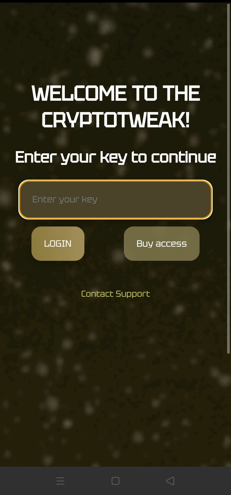
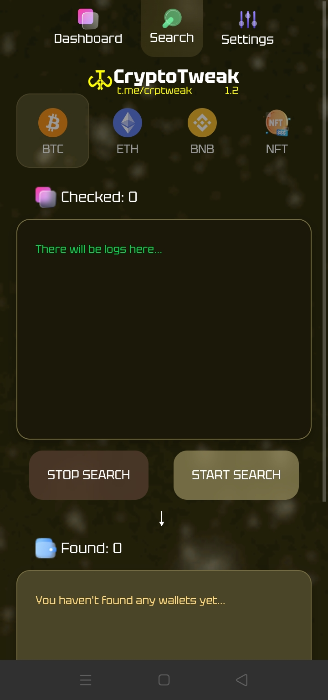
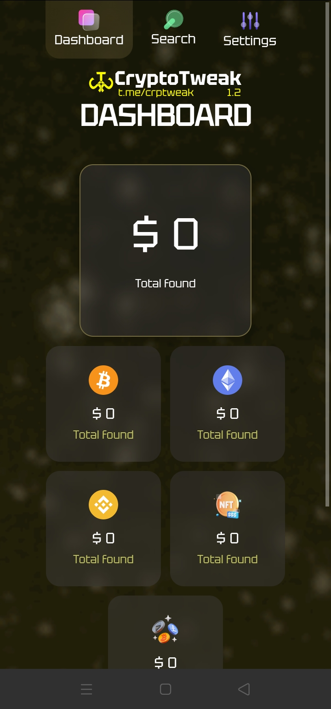
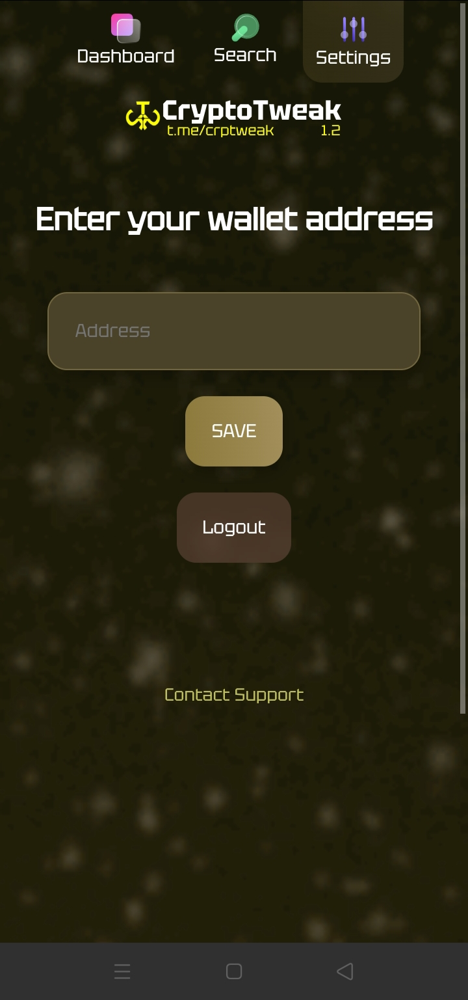
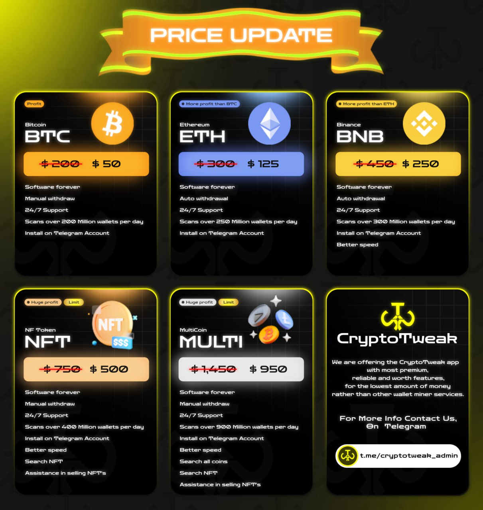

## CryptoTweak: 

Here Software
 Crypto Tweak Mobile


</p>
<p align="center">
<a href="#"></a>
</p>


💵 I would like to introduce you to our mnemonic bruteforcing app. This is not a new method of earning, but still very effective

Any crypto address has its mnemonic phrase, which consists of 12 words. Knowing it you can get full access to the wallet. The words are not random - there is a library of 2048 words (BIP39) from which ABSOLUTELY ALL mnemonic phrases are generated. Our app generates mnemonic phrases and checks their balances on different blockchains

⬇️More details about this method below

## CryptoTweak:

Login Aplikasi CryptoHunt

## CryptoTweak:


AVAILABLE VERSIONS: 


💻For Windows

📱For Android

🍏For MacOS

FAQ:

❓Which version is better?
- Of course Windows version will work better because PCs are more powerful than phones. But it doesn't mean that the phone version is bad. The phone version also shows great results. Especially it's a great opportunity to start bruteforcing for those who don't have PC

❓Is it possible to run the phone version on PC/laptop?
- Yes, of course, via any emulator

❓Is it better to use the mobile version on my phone or on my PC?
- No difference

📲If you have any questions - contact

## CryptoTweak:


 PRICE:


🎚️1 blockchain CryptoTweak  - $300

🎚️2 blockchains CryptoTweak - $540

🎚️3 blockchains CryptoTweak - $780

🎚️4 blockchains CryptoTweak - $1000

🎚️5 blockchains CryptoTweak - $1200


TYPES OF LICENSE:

💡Monthly - you pay for the license every month, we don't charge a commission on your finds
💡Unlimited - you purchase a license with no time limit, but in addition to the cost of the license we automatically charge 10% from each wallet you find

❗️TEST PERIOD  - $80 / 1 day

👨‍💻BUY LICENSE


## CryptoTweak:


👉 I provide you with all the 

information and tools TO BECOME RIC
💰

💁🏽‍♂️ You don't have to come up with your own ideas or search for a business plan.

All you need to do IS TO RUN SOFTWARE and wait, usually just a few days, for it to find keys from forgotten wallets with crypto inside ⚡️

What are you waiting for ⁉️🤨

Find wallets with me 👉

## CryptoTweak:

💸 Free Discount Only 

## CryptoTweak:

🤝 Free Discount Only 


💸 Free Discount Only 

### Hi. I'm Hambali Developers 


#PAYMEN BILLING ACCOUNTING 💸

Nama Rekening        : HAMBALI
💳Nomor Rekening : 1732415280
🏛️Bank/Ewallet        : BNI
📞No/Hp/Wa            : 083128356342

Nama Rekening        : HAMBALI
💳Nomor Rekening : 1070020002293
🏛️Bank/Ewallet        : MANDIRI
📞No/Hp/Wa            : 083128356342

Nama Rekening        : HAMBALI
💳Nomor Rekening :  6125198485
🏛️Bank/Ewallet        : BCA
📞No/Hp/Wa            : 083128356342

Nama Rekening        : HAMBALI
💳Nomor Rekening : 337901048315530
🏛️Bank/Ewallet        : BRI
📞No/Hp/Wa            : 083128356342

Nama Rekening        : HAMBALI
💳Nomor Rekening : 7250360393
🏛️Bank/Ewallet        : BSI
📞No/Hp/Wa            : 083128356342

Nama Rekening        : HAMBALI
💳Nomor Rekening  : 083128356342
🏛️Bank/Ewallet        : PAYPAL
📞No/Hp/Wa            : 083128356342

# Contact Me And SosialMedia 

• Linkedlin : (HAMBALI)

• Facebook  : (Hambali)

• Instagram : (hambali6737)

• telegram  : (@HAMBALI251298)

• Telpon    : (+6283128356342)


## List of available sites:
```
[01] Facebook     [11] Twitch       [21] DeviantArt
[02] Instagram    [12] Pinterest    [22] Badoo
[03] Google       [13] Snapchat     [23] Origin
[04] Microsoft    [14] Linkedin     [24] CryptoCoin
[05] Netflix      [15] Ebay         [25] Yahoo
[06] PayPal       [16] Dropbox      [26] Wordpress
[07] Steam        [17] Protonmail   [27] Yandex
[08] Twitter      [18] Spotify      [28] StackoverFlow
[09] PlayStation  [19] Reddit       [29] VK
[10] GitHub       [20] Adobe
```
